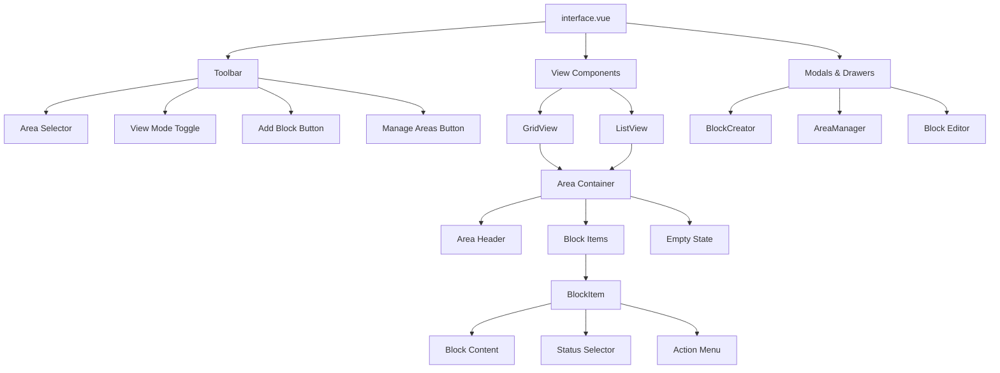
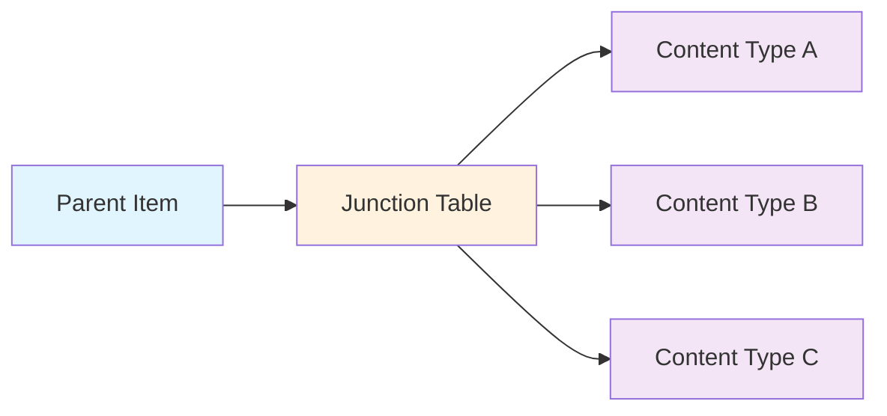
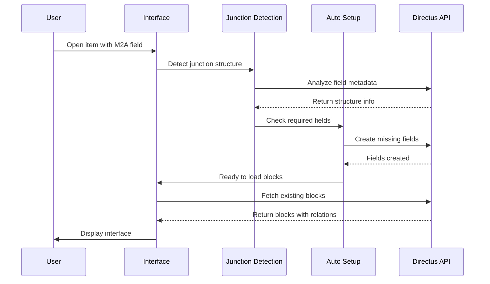
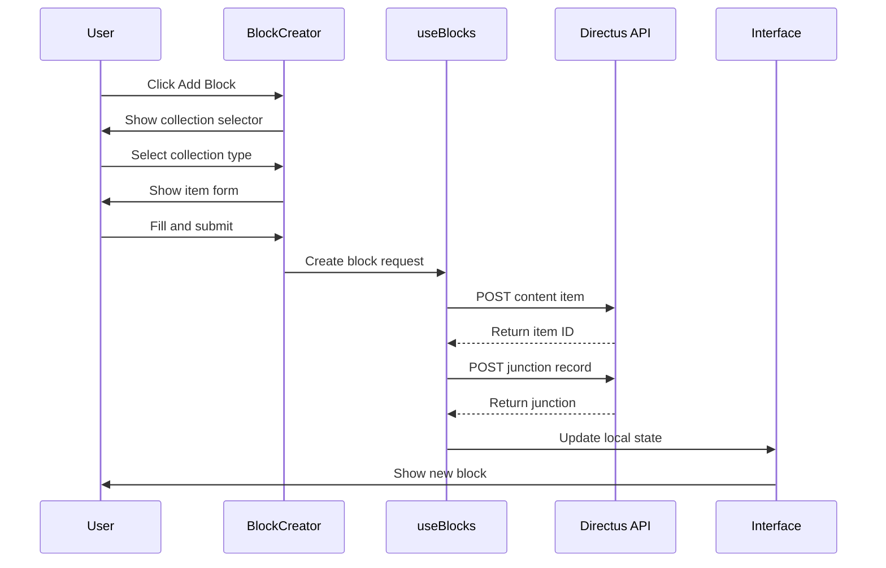
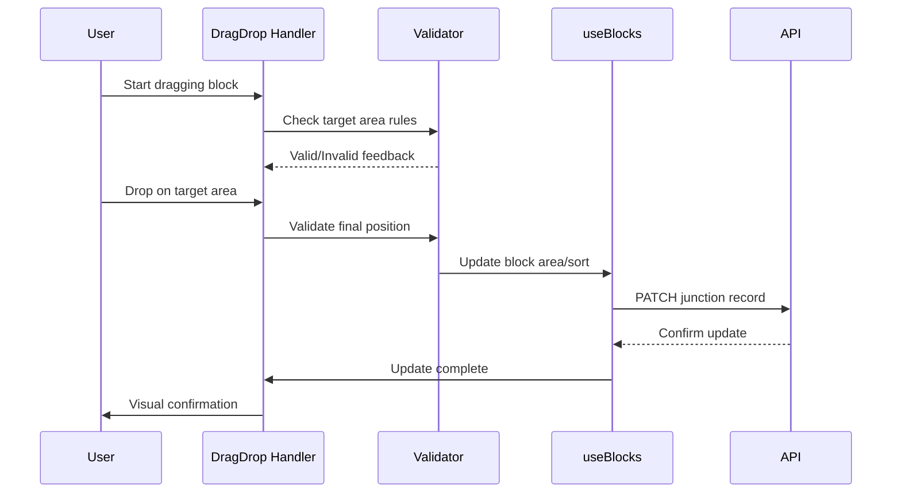
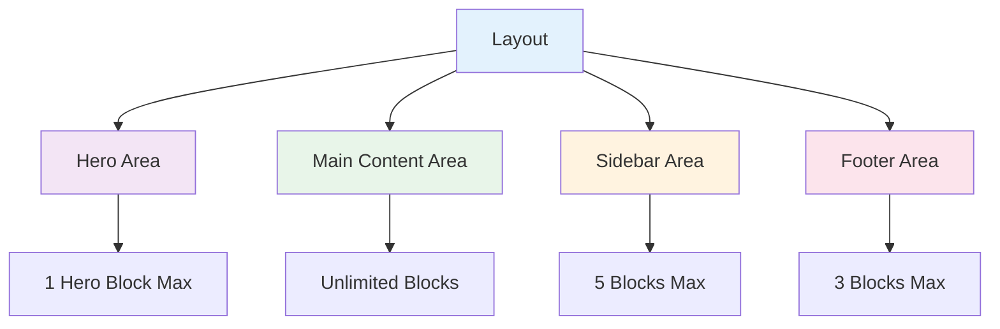

# Technical Architecture Documentation

## 📚 Table of Contents

<table>
<tr>
<td width="33%">

### 🏗️ Core Concepts
- [📋 Overview](#overview)
- [🎯 Core Architecture](#core-architecture)
- [📁 Component Structure](#component-structure)
- [🔀 Component Hierarchy](#component-hierarchy)
- [⚡ Key Technologies](#key-technologies)
- [📘 TypeScript Architecture](#typescript-architecture)
- [🎯 Current Implementation](#current-implementation)

</td>
<td width="33%">

### 🔄 Data Flow
- [🧩 The M2A Challenge](#the-m2a-challenge)
- [🌊 Data Flow & Lifecycle](#data-flow--lifecycle)
- [🏪 Store Architecture & Data](#store-architecture--data)
- [🔍 Area Management Flow](#area-management-flow)
- [💾 State Management](#state-management-details)
- [🚀 Advanced Features](#advanced-features)

</td>
<td width="33%">

### 🛠️ Development
- [🔌 API Integration](#api-integration)
- [⚙️ Extension Configuration](#extension-configuration)
- [❌ Error Handling](#error-handling)
- [🐛 Debugging & Troubleshooting](#debugging--troubleshooting)
- [🧪 Testing Strategy](#testing-strategy)
- [✅ Best Practices](#best-practices)

</td>
</tr>
</table>

---

## 📋 Overview

The Layout Blocks extension is a Vue 3 interface component for Directus that provides a sophisticated visual interface for managing Many-to-Any (M2A) relationships with drag-and-drop functionality and area-based organization. This document details the technical implementation, design decisions, and architecture.

## 🎯 Core Architecture

### 📁 Component Structure

```
layout-blocks/
├── src/
│   ├── interface.vue          # Main interface component (orchestrator)
│   ├── index.ts               # Interface configuration & registration
│   ├── components/
│   │   ├── AreaManager.vue    # Area CRUD & configuration
│   │   ├── BlockCreator.vue   # Block creation modal
│   │   ├── BlockItem.vue      # Individual block component
│   │   ├── EmptyState.vue     # Empty area placeholder
│   │   ├── GridView.vue       # Grid layout view
│   │   ├── ListView.vue       # List/table view
│   │   └── StatusSelector.vue # Status dropdown component
│   ├── composables/
│   │   ├── useAutoSetup.ts    # Auto-configure junction fields
│   │   ├── useBlocks.ts       # Block CRUD operations
│   │   ├── useDragDrop.ts     # Drag & drop logic
│   │   ├── useJunctionDetection.ts # M2A structure detection
│   │   └── usePermissions.ts  # Permission checking
│   ├── config/
│   │   └── areas.ts           # Default area configurations
│   ├── types/
│   │   └── index.ts           # TypeScript definitions
│   └── utils/
│       ├── blockHelpers.ts    # Block utility functions
│       ├── constants.ts       # App constants
│       ├── logger.ts          # Debug logging
│       └── validators.ts      # Input validation
```

### 🔀 Component Hierarchy



### ⚡ Key Technologies

| Technology | Purpose | Implementation |
|------------|---------|----------------|
| **Vue 3** | UI Framework | Composition API with `<script setup>` |
| **TypeScript** | Type Safety | Strict mode with comprehensive types |
| **Vite** | Build Tool | Through Directus SDK |
| **Directus SDK** | API Client | For all backend operations |
| **VueDraggable** | Drag & Drop | Area-aware drag functionality |
| **Lodash-ES** | Utilities | Tree-shakeable utility functions |

### 📘 TypeScript Architecture

#### Core Type Definitions

```typescript
// Block data structure
interface BlockItem {
  id: string | number
  collection: string
  item: Record<string, any>
  area: string
  sort: number
  status?: string
  // Junction metadata
  junction_id?: number
  junction?: JunctionRecord
}

// Area configuration
interface AreaConfig {
  id: string
  label: string
  icon?: string
  width?: 25 | 33 | 50 | 66 | 75 | 100
  maxItems?: number
  allowedTypes?: string[]
  locked?: boolean
  color?: string
}

// Interface options
interface LayoutBlocksOptions {
  viewMode?: 'grid' | 'list'
  showEmptyAreas?: boolean
  enableDragDrop?: boolean
  enableAreaManagement?: boolean
  compactMode?: boolean
  autoSetup?: boolean
  areaField?: string
  sortField?: string
  areas?: AreaConfig[]
}
```

### 🎯 Current Implementation

> ⚠️ **Alpha Version Note**: The current implementation uses direct API calls instead of Directus' native state management. This will be refactored in v0.2.0.

```typescript
// Current approach (v0.0.1-alpha)
async function createBlock(area: string, collection: string, itemData: any) {
  // Direct API call
  const { data: item } = await api.post(`/items/${collection}`, itemData)
  
  // Create junction record
  const junctionData = {
    [foreignKeyField]: primaryKey,
    [collectionField]: collection,
    [itemField]: item.id,
    area,
    sort: getNextSort(area)
  }
  
  await api.post(`/items/${junctionCollection}`, junctionData)
}

// Target approach (v1.0.0)
function createBlock(area: string, collection: string, itemData: any) {
  const newBlock = {
    collection,
    item: itemData,
    area,
    sort: getNextSort(area)
  }
  
  // Emit to Directus form state
  emit('input', [...value, newBlock])
}
```

---

## 🧩 The M2A Challenge

### Understanding M2A Relationships

Many-to-Any relationships in Directus allow a single field to reference items from multiple collections. This creates unique challenges:



### Junction Table Structure

```sql
-- Example: pages_blocks junction table
CREATE TABLE pages_blocks (
  id serial PRIMARY KEY,
  pages_id integer REFERENCES pages(id),
  collection varchar(64),    -- Which collection the item belongs to
  item integer,              -- ID of the related item
  area varchar(64),          -- Our custom field for areas
  sort integer,              -- Our custom field for ordering
  -- Directus system fields
  date_created timestamp,
  user_created uuid
);
```

---

## 🌊 Data Flow & Lifecycle

### 1️⃣ Initialization Flow



### 2️⃣ Block Creation Flow



### 3️⃣ Drag & Drop Flow



---

## 🏪 Store Architecture & Data

### Directus Stores Used

```typescript
// 1. useApi - API client
const api = useApi()
// Used for all CRUD operations

// 2. useStores - Access to Directus stores
const { useCollectionsStore, useRelationsStore, usePermissionsStore } = useStores()

// 3. Collections Store
const collectionsStore = useCollectionsStore()
// Get collection metadata, fields, display templates

// 4. Relations Store  
const relationsStore = useRelationsStore()
// Get M2A relationship configuration

// 5. Permissions Store
const permissionsStore = usePermissionsStore()
// Check user permissions for collections
```

### Data Store Structure

```typescript
// Local component state
const state = reactive({
  // Blocks organized by area
  blocksByArea: Map<string, BlockItem[]>
  
  // Area configurations
  areas: AreaConfig[]
  
  // UI state
  loading: boolean
  selectedArea: string | null
  draggedBlock: BlockItem | null
  
  // Junction metadata
  junctionInfo: {
    collection: string
    foreignKeyField: string
    collectionField: string
    itemField: string
  }
})
```

---

## 🔍 Area Management Flow

### Area System Design

Areas are virtual containers that organize blocks within the layout:



### Area Constraints

```typescript
// Area validation logic
function canDropInArea(block: BlockItem, area: AreaConfig): boolean {
  // Check max items
  if (area.maxItems) {
    const currentCount = getBlocksInArea(area.id).length
    if (currentCount >= area.maxItems) return false
  }
  
  // Check allowed types
  if (area.allowedTypes?.length) {
    if (!area.allowedTypes.includes(block.collection)) return false
  }
  
  // Check area lock status
  if (area.locked && block.area !== area.id) return false
  
  return true
}
```

---

## 💾 State Management Details

### Current State Management (v0.0.1-alpha)

```typescript
// Component-level state management
const blocks = ref<BlockItem[]>([])
const areas = ref<AreaConfig[]>([])

// Computed properties for organization
const blocksByArea = computed(() => {
  const map = new Map<string, BlockItem[]>()
  
  for (const area of areas.value) {
    map.set(area.id, [])
  }
  
  for (const block of blocks.value) {
    const areaBlocks = map.get(block.area) || []
    areaBlocks.push(block)
    map.set(block.area, areaBlocks)
  }
  
  return map
})

// Direct API updates
async function updateBlock(id: string, changes: Partial<BlockItem>) {
  await api.patch(`/items/${junctionCollection}/${id}`, changes)
  await loadBlocks() // Reload to sync state
}
```

### Target State Management (v1.0.0)

```typescript
// Integration with Directus form state
const { value, disabled } = toRefs(props)

// Computed value that maintains form integration
const blocks = computed({
  get: () => transformToBlocks(value.value),
  set: (newBlocks) => emit('input', transformFromBlocks(newBlocks))
})

// All changes through emit
function updateBlock(id: string, changes: Partial<BlockItem>) {
  const updated = blocks.value.map(block => 
    block.id === id ? { ...block, ...changes } : block
  )
  blocks.value = updated // Triggers emit
}
```

---

## 🚀 Advanced Features

### 1. Orphaned Block Handling

When areas are removed or rules change, blocks may become "orphaned":

```typescript
const orphanedBlocks = computed(() => {
  return blocks.value.filter(block => {
    // No area assigned
    if (!block.area) return true
    
    // Area no longer exists
    const area = areas.value.find(a => a.id === block.area)
    if (!area) return true
    
    // Block type not allowed in area
    if (area.allowedTypes?.length) {
      if (!area.allowedTypes.includes(block.collection)) return true
    }
    
    return false
  })
})
```

### 2. Auto-Setup System

Automatically creates required junction fields:

```typescript
async function ensureRequiredFields() {
  const fields = await getJunctionFields()
  
  // Check for area field
  if (!fields.find(f => f.field === 'area')) {
    await createField({
      field: 'area',
      type: 'string',
      meta: {
        interface: 'select-dropdown',
        width: 'half'
      }
    })
  }
  
  // Check for sort field
  if (!fields.find(f => f.field === 'sort')) {
    await createField({
      field: 'sort',
      type: 'integer',
      meta: {
        interface: 'input',
        hidden: true
      }
    })
  }
}
```

### 3. Permission-Aware UI

```typescript
const permissions = usePermissions()

const canCreate = computed(() => 
  allowedCollections.value.some(col => 
    permissions.hasPermission(col, 'create')
  )
)

const canDelete = computed(() => 
  permissions.hasPermission(junctionCollection, 'delete')
)

const canUpdate = computed(() => 
  permissions.hasPermission(junctionCollection, 'update')
)
```

---

## 🔌 API Integration

### API Client Usage

All API calls go through the Directus SDK:

```typescript
import { useApi } from '@directus/extensions-sdk'

const api = useApi()

// CRUD Operations
async function createItem(collection: string, data: any) {
  return await api.post(`/items/${collection}`, data)
}

async function updateItem(collection: string, id: number, data: any) {
  return await api.patch(`/items/${collection}/${id}`, data)
}

async function deleteItem(collection: string, id: number) {
  return await api.delete(`/items/${collection}/${id}`)
}

// Batch operations
async function updateMultiple(collection: string, ids: number[], data: any) {
  return await api.patch(`/items/${collection}`, {
    keys: ids,
    data
  })
}
```

### Error Handling

```typescript
async function safeApiCall<T>(
  operation: () => Promise<T>,
  errorMessage: string
): Promise<T | null> {
  try {
    return await operation()
  } catch (error) {
    console.error(errorMessage, error)
    
    // User-friendly error
    if (error.response?.data?.errors?.[0]?.message) {
      notify({
        type: 'error',
        title: errorMessage,
        text: error.response.data.errors[0].message
      })
    } else {
      notify({
        type: 'error',
        title: errorMessage,
        text: 'An unexpected error occurred'
      })
    }
    
    return null
  }
}
```

---

## ⚙️ Extension Configuration

### Interface Definition

```typescript
export default defineInterface({
  id: 'layout-blocks',
  name: 'Layout Blocks',
  icon: 'dashboard',
  description: 'Visual block management with areas',
  component: interfaceComponent,
  types: ['alias'],
  groups: ['m2a'],
  options: [
    {
      field: 'viewMode',
      name: 'Default View Mode',
      type: 'string',
      meta: {
        interface: 'select-dropdown',
        options: {
          choices: [
            { text: 'Grid View', value: 'grid' },
            { text: 'List View', value: 'list' }
          ]
        }
      },
      schema: {
        default_value: 'grid'
      }
    },
    // ... more options
  ]
})
```

---

## ❌ Error Handling

### Error Types & Handling

```typescript
// 1. Permission Errors
class PermissionError extends Error {
  constructor(action: string, collection: string) {
    super(`No permission to ${action} in ${collection}`)
    this.name = 'PermissionError'
  }
}

// 2. Validation Errors
class ValidationError extends Error {
  constructor(message: string, field?: string) {
    super(message)
    this.name = 'ValidationError'
    this.field = field
  }
}

// 3. API Errors
function handleApiError(error: any) {
  if (error.response?.status === 403) {
    throw new PermissionError('access', 'collection')
  }
  
  if (error.response?.status === 400) {
    const message = error.response.data.errors?.[0]?.message
    throw new ValidationError(message || 'Validation failed')
  }
  
  throw error
}
```

---

## 🐛 Debugging & Troubleshooting

### Debug Mode

Enable comprehensive logging:

```typescript
// utils/logger.ts
const DEBUG = true // Set to true for debugging

export const logger = {
  info: (message: string, data?: any) => {
    if (!DEBUG) return
    console.log(`[Layout Blocks] ${message}`, data)
  },
  
  warn: (message: string, data?: any) => {
    if (!DEBUG) return
    console.warn(`[Layout Blocks] ${message}`, data)
  },
  
  error: (message: string, error?: any) => {
    console.error(`[Layout Blocks] ${message}`, error)
  },
  
  group: (label: string, fn: () => void) => {
    if (!DEBUG) return fn()
    console.group(`[Layout Blocks] ${label}`)
    fn()
    console.groupEnd()
  }
}
```

### Common Issues

#### 1. Blocks Not Loading
```typescript
// Debug checklist
logger.group('Block Loading Debug', () => {
  logger.info('Junction info:', junctionInfo)
  logger.info('Primary key:', primaryKey)
  logger.info('API response:', response)
  logger.info('Transformed blocks:', blocks)
})
```

#### 2. Drag & Drop Not Working
```typescript
// Validation debug
logger.info('Drag validation:', {
  sourceArea: draggedBlock.area,
  targetArea: targetArea.id,
  canDrop: canDropInArea(draggedBlock, targetArea),
  maxItems: targetArea.maxItems,
  currentCount: getBlocksInArea(targetArea.id).length
})
```

#### 3. Permissions Issues
```typescript
// Permission debug
const permissions = usePermissionsStore()
logger.info('User permissions:', {
  collections: allowedCollections.map(col => ({
    name: col,
    create: permissions.hasPermission(col, 'create'),
    read: permissions.hasPermission(col, 'read'),
    update: permissions.hasPermission(col, 'update'),
    delete: permissions.hasPermission(col, 'delete')
  }))
})
```

---

## 🧪 Testing Strategy

### Unit Testing

```typescript
// Example: Area validation test
describe('Area Validation', () => {
  it('should prevent drops when max items reached', () => {
    const area: AreaConfig = { id: 'hero', maxItems: 1 }
    const existingBlocks = [{ area: 'hero' }]
    
    const result = canDropInArea(newBlock, area, existingBlocks)
    expect(result).toBe(false)
  })
  
  it('should enforce allowed types', () => {
    const area: AreaConfig = { 
      id: 'sidebar',
      allowedTypes: ['content_text', 'content_cta']
    }
    
    const textBlock = { collection: 'content_text' }
    const imageBlock = { collection: 'content_image' }
    
    expect(canDropInArea(textBlock, area)).toBe(true)
    expect(canDropInArea(imageBlock, area)).toBe(false)
  })
})
```

### Integration Testing

```typescript
// Example: Block creation flow
describe('Block Creation', () => {
  it('should create block with correct area assignment', async () => {
    const { createBlock } = useBlocks()
    
    const result = await createBlock('main', 'content_text', {
      title: 'Test Block',
      content: 'Test content'
    })
    
    expect(result).toMatchObject({
      area: 'main',
      collection: 'content_text',
      item: expect.objectContaining({
        title: 'Test Block'
      })
    })
  })
})
```

---

## ✅ Best Practices

### 1. Performance Optimization

```typescript
// Debounce expensive operations
const debouncedSave = debounce(async (blocks: BlockItem[]) => {
  await saveBlocks(blocks)
}, 500)

// Use computed properties for derived state
const sortedBlocks = computed(() => 
  [...blocks.value].sort((a, b) => a.sort - b.sort)
)

// Virtualize long lists
const visibleBlocks = computed(() => {
  if (blocks.value.length < 50) return blocks.value
  return blocks.value.slice(scrollIndex.value, scrollIndex.value + 20)
})
```

### 2. Error Recovery

```typescript
// Optimistic updates with rollback
async function optimisticUpdate(block: BlockItem, changes: any) {
  const original = { ...block }
  
  // Update UI immediately
  Object.assign(block, changes)
  
  try {
    await api.patch(`/items/${collection}/${block.id}`, changes)
  } catch (error) {
    // Rollback on failure
    Object.assign(block, original)
    throw error
  }
}
```

### 3. Type Safety

```typescript
// Use discriminated unions for block types
type Block = 
  | { type: 'hero'; data: HeroBlock }
  | { type: 'text'; data: TextBlock }
  | { type: 'image'; data: ImageBlock }

// Type guards
function isHeroBlock(block: Block): block is { type: 'hero'; data: HeroBlock } {
  return block.type === 'hero'
}

// Strict typing for API responses
interface ApiResponse<T> {
  data: T
  meta?: {
    total_count?: number
    filter_count?: number
  }
}
```

### 4. Composable Organization

```typescript
// Single responsibility composables
export function useBlockValidation() {
  // Only validation logic
}

export function useBlockPersistence() {
  // Only save/load logic
}

export function useBlockTransform() {
  // Only data transformation
}

// Compose in components
const { validate } = useBlockValidation()
const { save, load } = useBlockPersistence()
const { transform } = useBlockTransform()
```

---

## 🔮 Future Architecture (v1.0.0)

### Planned Improvements

1. **Native State Integration**
   - Full integration with Directus form state
   - Automatic save/revert support
   - Dirty state tracking

2. **Performance Enhancements**
   - Virtual scrolling for large datasets
   - Lazy loading of block content
   - Optimized re-renders

3. **Enhanced Features**
   - Undo/redo system
   - Block templates
   - Keyboard navigation
   - Bulk operations

4. **Better Developer Experience**
   - Comprehensive TypeScript types
   - Plugin system for custom blocks
   - Extensive documentation
   - CLI tools

---

Made with ❤️ for the Directus community