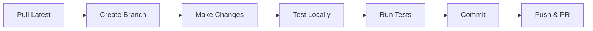
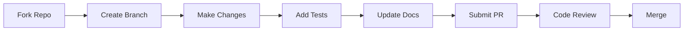

# Development Guide

## 📚 Table of Contents

<table>
<tr>
<td width="33%">

### 🚀 Getting Started
- [📋 Prerequisites](#prerequisites)
- [🔧 Development Setup](#development-setup)
- [🔄 Development Workflow](#development-workflow)
- [📁 Project Structure](#project-structure)

</td>
<td width="33%">

### 💻 Development
- [📝 Code Standards](#code-standards)
- [🎨 Component Guidelines](#component-guidelines)
- [🧩 Composables Pattern](#composables-pattern)
- [🎯 Common Tasks](#common-tasks)

</td>
<td width="33%">

### 🧪 Quality
- [🔬 Testing](#testing)
- [🐛 Debugging](#debugging)
- [⚡ Performance](#performance)
- [🤝 Contributing](#contributing)

</td>
</tr>
</table>

---

## 📋 Prerequisites

Before you begin development, ensure you have:

- **Node.js** 18.0 or higher
- **npm** or **yarn** package manager
- **Directus** 10.x development instance
- **Git** for version control
- **TypeScript** knowledge (recommended)
- **Vue 3** experience (recommended)

### Recommended Tools

- 🛠️ **VS Code** with Vue Language Features extension
- 🔍 **Vue DevTools** browser extension
- 📊 **Directus Insights** for debugging
- 🎨 **Prettier** for code formatting

---

## 🔧 Development Setup

### 1️⃣ Clone the Repository

```bash
# Clone the repository
git clone https://github.com/smartlabsAT/directus-layout-blocks.git
cd directus-layout-blocks

# Switch to develop branch
git checkout develop
```

### 2️⃣ Install Dependencies

```bash
# Install all dependencies
npm install

# Or using yarn
yarn install
```

### 3️⃣ Build Setup

```bash
# Development build with watch mode
npm run dev

# Production build
npm run build

# Run tests
npm test
```

### 4️⃣ Link to Directus

#### Option A: Symlink (Recommended for Development)

```bash
# Create symlink to your Directus extensions folder
ln -s $(pwd)/dist /path/to/directus/extensions/interfaces/layout-blocks

# On Windows
mklink /D "C:\path\to\directus\extensions\interfaces\layout-blocks" "%cd%\dist"
```

#### Option B: Copy Files

```bash
# Copy built files to Directus
cp -r dist/* /path/to/directus/extensions/interfaces/layout-blocks/

# Watch and copy automatically
npm run dev -- --watch
```

### 5️⃣ Configure Directus

1. Restart Directus after installing the extension
2. Create an M2A field in your collection
3. Select "Layout Blocks" as the interface
4. Configure areas and options

---

## 🔄 Development Workflow

### Daily Development Flow



### Branch Strategy

```bash
main          # Stable releases
develop       # Active development
feature/*     # New features
bugfix/*      # Bug fixes
hotfix/*      # Urgent fixes
```

### Development Commands

```bash
# Start development
npm run dev

# Run type checking
npm run typecheck

# Run linting
npm run lint

# Run tests
npm test

# Build for production
npm run build
```

---

## 📁 Project Structure

```
layout-blocks/
├── 📁 src/
│   ├── 📄 interface.vue          # Main component
│   ├── 📄 index.ts               # Extension entry
│   │
│   ├── 📁 components/            # Vue components
│   │   ├── 🎨 AreaManager.vue    # Area configuration
│   │   ├── ➕ BlockCreator.vue   # Block creation
│   │   ├── 📦 BlockItem.vue      # Block display
│   │   ├── 🗑️ EmptyState.vue     # Empty placeholder
│   │   ├── 🏷️ GridView.vue       # Grid layout
│   │   ├── 📋 ListView.vue       # List layout
│   │   └── 🔄 StatusSelector.vue # Status control
│   │
│   ├── 📁 composables/           # Vue composables
│   │   ├── 🔧 useAutoSetup.ts    # Auto configuration
│   │   ├── 📦 useBlocks.ts       # Block operations
│   │   ├── 🎯 useDragDrop.ts    # Drag functionality
│   │   ├── 🔍 useJunctionDetection.ts # M2A detection
│   │   └── 🔐 usePermissions.ts # Permission checks
│   │
│   ├── 📁 config/               # Configuration
│   │   └── 🏗️ areas.ts          # Area presets
│   │
│   ├── 📁 types/                # TypeScript types
│   │   └── 📘 index.ts          # Type definitions
│   │
│   └── 📁 utils/                # Utilities
│       ├── 🛠️ blockHelpers.ts   # Block utilities
│       ├── 📋 constants.ts      # Constants
│       ├── 📝 logger.ts         # Debug logging
│       └── ✅ validators.ts     # Validation
│
├── 📁 tests/                    # Test files
├── 📄 package.json             # Dependencies
├── 📄 tsconfig.json           # TypeScript config
└── 📄 README.md               # Documentation
```

---

## 📝 Code Standards

### TypeScript Guidelines

#### 1️⃣ Strict Typing

```typescript
// ❌ Avoid 'any' type
function processBlock(data: any) { }

// ✅ Use specific types
function processBlock(data: BlockItem): void { }

// ✅ Define interfaces
interface BlockItem {
  id: string | number
  collection: string
  item: Record<string, any>
  area: string
  sort: number
}
```

#### 2️⃣ Type Guards

```typescript
// Type predicate functions
function isBlockItem(item: unknown): item is BlockItem {
  return (
    typeof item === 'object' &&
    item !== null &&
    'id' in item &&
    'collection' in item
  )
}

// Discriminated unions
type ViewMode = 'grid' | 'list'
type BlockStatus = 'published' | 'draft' | 'archived'
```

#### 3️⃣ Generics

```typescript
// Generic composable
function useCollection<T extends Record<string, any>>(
  collection: string
) {
  const items = ref<T[]>([])
  const loading = ref(false)
  
  async function load(): Promise<T[]> {
    // Implementation
  }
  
  return { items, loading, load }
}
```

### Code Style

#### 1️⃣ Naming Conventions

```typescript
// PascalCase for components and types
interface BlockItem { }
const BlockComponent = { }

// camelCase for variables and functions
const blockCount = 0
function getBlockTitle() { }

// UPPER_SNAKE_CASE for constants
const MAX_BLOCKS = 100
const DEFAULT_AREA = 'main'

// Prefix composables with 'use'
function useBlocks() { }
function useDragDrop() { }
```

#### 2️⃣ File Organization

```typescript
// 1. Imports (grouped and sorted)
import { ref, computed } from 'vue'
import type { Ref, ComputedRef } from 'vue'

// External libraries
import { debounce } from 'lodash-es'

// Internal imports
import { useApi } from '@directus/extensions-sdk'
import type { BlockItem } from '../types'
import { logger } from '../utils/logger'

// 2. Type definitions
interface Props { }
interface Emits { }

// 3. Constants
const MAX_ITEMS = 10

// 4. Main export
export function useExample() { }
```

---

## 🎨 Component Guidelines

### Vue 3 Composition API

#### 1️⃣ Component Template

```vue
<template>
  <div class="block-item" :class="blockClasses">
    <div class="block-item__header">
      <h3 class="block-item__title">{{ title }}</h3>
      <status-selector 
        v-model="status" 
        @update:modelValue="handleStatusChange"
      />
    </div>
    <div class="block-item__content">
      <slot />
    </div>
  </div>
</template>

<script setup lang="ts">
import { computed } from 'vue'
import StatusSelector from './StatusSelector.vue'
import type { BlockItem, BlockStatus } from '../types'

// Props with defaults
interface Props {
  block: BlockItem
  editable?: boolean
  compact?: boolean
}

const props = withDefaults(defineProps<Props>(), {
  editable: true,
  compact: false
})

// Typed emits
const emit = defineEmits<{
  'update:block': [block: BlockItem]
  'delete': [id: string | number]
  'statusChange': [status: BlockStatus]
}>()

// Computed properties
const title = computed(() => 
  props.block.item?.title || `Block #${props.block.id}`
)

const blockClasses = computed(() => ({
  'block-item--editable': props.editable,
  'block-item--compact': props.compact,
  [`block-item--${props.block.status}`]: true
}))

// Methods
function handleStatusChange(status: BlockStatus) {
  emit('statusChange', status)
}
</script>

<style lang="scss" scoped>
.block-item {
  background: var(--background-normal);
  border: 2px solid var(--border-normal);
  border-radius: var(--border-radius);
  padding: var(--input-padding);
  
  &--editable {
    cursor: pointer;
    
    &:hover {
      border-color: var(--primary);
    }
  }
  
  &--compact {
    padding: calc(var(--input-padding) / 2);
  }
  
  &__header {
    display: flex;
    justify-content: space-between;
    align-items: center;
    margin-bottom: 12px;
  }
  
  &__title {
    font-size: 16px;
    font-weight: 600;
    margin: 0;
  }
}
</style>
```

#### 2️⃣ Props & Emits Best Practices

```typescript
// Always define interfaces
interface Props {
  modelValue: BlockItem[]
  disabled?: boolean
  options?: LayoutBlocksOptions
}

// Use withDefaults for optional props
const props = withDefaults(defineProps<Props>(), {
  disabled: false,
  options: () => ({})
})

// Type emit functions
const emit = defineEmits<{
  'update:modelValue': [value: BlockItem[]]
  'error': [error: Error]
}>()

// Helper for v-model
const blocks = computed({
  get: () => props.modelValue,
  set: (value) => emit('update:modelValue', value)
})
```

---

## 🧩 Composables Pattern

### Creating Reusable Logic

#### 1️⃣ Basic Composable

```typescript
// composables/useCounter.ts
import { ref, computed } from 'vue'

export function useCounter(initialValue = 0) {
  // State
  const count = ref(initialValue)
  
  // Computed
  const doubled = computed(() => count.value * 2)
  const isEven = computed(() => count.value % 2 === 0)
  
  // Methods
  function increment() {
    count.value++
  }
  
  function decrement() {
    count.value--
  }
  
  function reset() {
    count.value = initialValue
  }
  
  // Return public API
  return {
    count: readonly(count),
    doubled,
    isEven,
    increment,
    decrement,
    reset
  }
}
```

#### 2️⃣ Async Composable

```typescript
// composables/useAsyncData.ts
export function useAsyncData<T>(
  fetcher: () => Promise<T>
) {
  const data = ref<T | null>(null)
  const error = ref<Error | null>(null)
  const loading = ref(false)
  
  async function execute() {
    loading.value = true
    error.value = null
    
    try {
      data.value = await fetcher()
    } catch (e) {
      error.value = e as Error
      console.error('Async operation failed:', e)
    } finally {
      loading.value = false
    }
  }
  
  // Auto-execute on mount
  onMounted(() => execute())
  
  return {
    data: readonly(data),
    error: readonly(error),
    loading: readonly(loading),
    execute
  }
}
```

#### 3️⃣ Shared State Composable

```typescript
// composables/useSharedState.ts
const globalState = reactive({
  user: null,
  theme: 'light',
  locale: 'en'
})

export function useSharedState() {
  // Computed getters
  const isAuthenticated = computed(() => 
    globalState.user !== null
  )
  
  const isDarkMode = computed(() => 
    globalState.theme === 'dark'
  )
  
  // Methods
  function setUser(user: User | null) {
    globalState.user = user
  }
  
  function toggleTheme() {
    globalState.theme = globalState.theme === 'light' 
      ? 'dark' 
      : 'light'
  }
  
  return {
    state: readonly(globalState),
    isAuthenticated,
    isDarkMode,
    setUser,
    toggleTheme
  }
}
```

---

## 🎯 Common Tasks

### Adding a New Component

#### 1️⃣ Create Component File

```vue
<!-- components/NewFeature.vue -->
<template>
  <div class="new-feature">
    <!-- Component template -->
  </div>
</template>

<script setup lang="ts">
// Component logic
</script>

<style scoped>
/* Component styles */
</style>
```

#### 2️⃣ Add TypeScript Types

```typescript
// types/index.ts
export interface NewFeatureConfig {
  enabled: boolean
  options: Record<string, any>
}
```

#### 3️⃣ Register in Parent

```typescript
// interface.vue
import NewFeature from './components/NewFeature.vue'

// Use in template
<new-feature v-if="showNewFeature" />
```

### Adding a New View Mode

#### 1️⃣ Create View Component

```vue
<!-- components/TimelineView.vue -->
<template>
  <div class="timeline-view">
    <div 
      v-for="(group, date) in groupedBlocks" 
      :key="date"
      class="timeline-group"
    >
      <h3>{{ formatDate(date) }}</h3>
      <block-item 
        v-for="block in group" 
        :key="block.id"
        :block="block"
      />
    </div>
  </div>
</template>
```

#### 2️⃣ Update Constants

```typescript
// utils/constants.ts
export const VIEW_MODES = {
  GRID: 'grid',
  LIST: 'list',
  TIMELINE: 'timeline' // New!
} as const
```

#### 3️⃣ Add to Interface

```typescript
// interface.vue
const viewComponents = {
  grid: GridView,
  list: ListView,
  timeline: TimelineView // New!
}
```

### Implementing a New Feature

#### 1️⃣ Plan the Feature

```typescript
// 1. Define requirements
// 2. Update types if needed
// 3. Create composable for logic
// 4. Build UI components
// 5. Add tests
// 6. Update documentation
```

#### 2️⃣ Example: Block Templates

```typescript
// types/index.ts
export interface BlockTemplate {
  id: string
  name: string
  collection: string
  data: Record<string, any>
}

// composables/useBlockTemplates.ts
export function useBlockTemplates() {
  const templates = ref<BlockTemplate[]>([])
  
  async function loadTemplates() {
    // Load from API or config
  }
  
  function applyTemplate(
    template: BlockTemplate
  ): BlockItem {
    return {
      id: generateId(),
      collection: template.collection,
      item: { ...template.data },
      area: 'main',
      sort: 0
    }
  }
  
  return {
    templates,
    loadTemplates,
    applyTemplate
  }
}
```

---

## 🔬 Testing

### Test Structure

```
tests/
├── unit/
│   ├── components/
│   ├── composables/
│   └── utils/
├── integration/
└── e2e/
```

### Unit Testing

#### 1️⃣ Component Test

```typescript
// tests/unit/components/BlockItem.test.ts
import { describe, it, expect } from 'vitest'
import { mount } from '@vue/test-utils'
import BlockItem from '@/components/BlockItem.vue'

describe('BlockItem', () => {
  const mockBlock = {
    id: 1,
    collection: 'content_text',
    item: { title: 'Test Block' },
    area: 'main',
    sort: 0
  }
  
  it('renders block title', () => {
    const wrapper = mount(BlockItem, {
      props: { block: mockBlock }
    })
    
    expect(wrapper.text()).toContain('Test Block')
  })
  
  it('emits delete event', async () => {
    const wrapper = mount(BlockItem, {
      props: { block: mockBlock }
    })
    
    await wrapper.find('.delete-btn').trigger('click')
    
    expect(wrapper.emitted('delete')).toBeTruthy()
    expect(wrapper.emitted('delete')[0]).toEqual([1])
  })
})
```

#### 2️⃣ Composable Test

```typescript
// tests/unit/composables/useBlocks.test.ts
import { describe, it, expect, vi } from 'vitest'
import { useBlocks } from '@/composables/useBlocks'

describe('useBlocks', () => {
  it('loads blocks on init', async () => {
    const mockApi = {
      get: vi.fn().mockResolvedValue({
        data: { data: [] }
      })
    }
    
    const { blocks, loadBlocks } = useBlocks(mockApi)
    
    await loadBlocks()
    
    expect(mockApi.get).toHaveBeenCalled()
    expect(blocks.value).toEqual([])
  })
})
```

### Integration Testing

```typescript
// tests/integration/block-operations.test.ts
describe('Block Operations', () => {
  it('creates and moves block', async () => {
    // Test complete flow
    const { createBlock, moveBlock } = useBlocks()
    
    // Create
    const block = await createBlock('main', 'content_text', {
      title: 'New Block'
    })
    
    expect(block.area).toBe('main')
    
    // Move
    await moveBlock(block.id, 'sidebar')
    
    expect(block.area).toBe('sidebar')
  })
})
```

### E2E Testing

```typescript
// tests/e2e/layout-blocks.spec.ts
import { test, expect } from '@playwright/test'

test('complete block workflow', async ({ page }) => {
  // Navigate to page with layout blocks
  await page.goto('/admin/content/pages/1')
  
  // Add block
  await page.click('[data-test="add-block"]')
  await page.click('[data-test="collection-content_text"]')
  await page.fill('[data-test="block-title"]', 'E2E Test Block')
  await page.click('[data-test="create-block"]')
  
  // Verify
  await expect(page.locator('.block-item'))
    .toContainText('E2E Test Block')
  
  // Drag to different area
  await page.dragAndDrop(
    '.block-item',
    '[data-test="area-sidebar"]'
  )
  
  // Verify move
  await expect(
    page.locator('[data-test="area-sidebar"] .block-item')
  ).toHaveCount(1)
})
```

---

## 🐛 Debugging

### Debug Mode Setup

#### 1️⃣ Enable Logging

```typescript
// utils/logger.ts
const DEBUG = true // Enable debug mode

export const logger = {
  log: (message: string, ...args: any[]) => {
    if (!DEBUG) return
    console.log(`[Layout Blocks] ${message}`, ...args)
  },
  
  warn: (message: string, ...args: any[]) => {
    if (!DEBUG) return
    console.warn(`[Layout Blocks] ${message}`, ...args)
  },
  
  error: (message: string, ...args: any[]) => {
    console.error(`[Layout Blocks] ${message}`, ...args)
  },
  
  group: (label: string, fn: () => void) => {
    if (!DEBUG) return fn()
    console.group(`[Layout Blocks] ${label}`)
    fn()
    console.groupEnd()
  },
  
  time: (label: string) => {
    if (!DEBUG) return
    console.time(`[Layout Blocks] ${label}`)
  },
  
  timeEnd: (label: string) => {
    if (!DEBUG) return
    console.timeEnd(`[Layout Blocks] ${label}`)
  }
}
```

#### 2️⃣ Debug Components

```typescript
// Add debug info to components
onMounted(() => {
  logger.group('BlockItem mounted', () => {
    logger.log('Props:', props)
    logger.log('Block data:', props.block)
  })
})

watch(() => props.block, (newBlock, oldBlock) => {
  logger.log('Block updated:', { 
    old: oldBlock, 
    new: newBlock 
  })
})
```

### Vue DevTools

1. Install Vue DevTools browser extension
2. Open DevTools (F12)
3. Navigate to Vue tab
4. Inspect:
   - Component tree
   - Props & state
   - Events
   - Performance

### Common Issues & Solutions

#### 🔴 Blocks Not Loading

```typescript
// Debug checklist
logger.group('Loading debug', () => {
  logger.log('Collection:', collection)
  logger.log('Field:', field)
  logger.log('Primary key:', primaryKey)
  logger.log('Junction info:', junctionInfo)
})

// Check API response
try {
  const response = await api.get(endpoint)
  logger.log('API response:', response)
} catch (error) {
  logger.error('API error:', error)
}
```

#### 🔴 Drag & Drop Issues

```typescript
// Add drag debug
function handleDragStart(e: DragEvent, block: BlockItem) {
  logger.log('Drag start:', block)
  logger.log('Allowed areas:', getAllowedAreas(block))
}

function handleDrop(e: DragEvent, area: string) {
  logger.log('Drop attempt:', {
    area,
    canDrop: canDropInArea(draggedBlock, area),
    reason: getDropReason(draggedBlock, area)
  })
}
```

#### 🔴 Performance Issues

```typescript
// Performance monitoring
logger.time('loadBlocks')
await loadBlocks()
logger.timeEnd('loadBlocks')

// Component render tracking
onMounted(() => {
  performance.mark('component-mounted')
})

onUpdated(() => {
  performance.mark('component-updated')
  performance.measure(
    'update-duration',
    'component-mounted',
    'component-updated'
  )
})
```

---

## ⚡ Performance

### Optimization Techniques

#### 1️⃣ Computed Property Optimization

```typescript
// ❌ Bad: Recalculates on every change
const processedBlocks = computed(() => {
  return blocks.value
    .map(b => expensiveTransform(b))
    .filter(b => b.visible)
    .sort((a, b) => a.sort - b.sort)
})

// ✅ Good: Separate concerns
const transformedBlocks = computed(() => 
  blocks.value.map(b => expensiveTransform(b))
)

const visibleBlocks = computed(() => 
  transformedBlocks.value.filter(b => b.visible)
)

const sortedBlocks = computed(() => 
  [...visibleBlocks.value].sort((a, b) => a.sort - b.sort)
)
```

#### 2️⃣ Debouncing

```typescript
import { debounce } from 'lodash-es'

// Debounce expensive operations
const debouncedSave = debounce(async (data: any) => {
  await api.patch(endpoint, data)
}, 500)

// Use in watcher
watch(blocks, () => {
  debouncedSave(blocks.value)
}, { deep: true })
```

#### 3️⃣ Virtual Scrolling

```typescript
// For large lists
const visibleRange = computed(() => {
  const start = Math.floor(scrollTop.value / itemHeight)
  const end = Math.ceil(
    (scrollTop.value + containerHeight.value) / itemHeight
  )
  
  return { start, end }
})

const visibleBlocks = computed(() => 
  blocks.value.slice(
    visibleRange.value.start,
    visibleRange.value.end
  )
)
```

#### 4️⃣ Lazy Loading

```typescript
// Load block details on demand
const blockCache = new Map<number, any>()

async function getBlockDetails(id: number) {
  if (blockCache.has(id)) {
    return blockCache.get(id)
  }
  
  const details = await api.get(`/items/${collection}/${id}`)
  blockCache.set(id, details.data)
  
  return details.data
}
```

### Performance Monitoring

```typescript
// Monitor render performance
const renderCount = ref(0)

onUpdated(() => {
  renderCount.value++
  
  if (renderCount.value > 100) {
    logger.warn('Excessive re-renders detected')
  }
})

// Track API calls
let apiCallCount = 0

api.interceptors.request.use((config) => {
  apiCallCount++
  logger.log(`API call #${apiCallCount}:`, config.url)
  return config
})
```

---

## 🤝 Contributing

### Before You Start

1. **Read the docs**: Understand the architecture
2. **Check issues**: See if someone's working on it
3. **Discuss**: Open an issue for major changes
4. **Follow standards**: Use our code guidelines

### Contribution Flow



### Commit Convention

We use [Conventional Commits](https://www.conventionalcommits.org/):

```bash
# Features
feat: add timeline view mode
feat(drag): support multi-select drag

# Fixes
fix: resolve Safari drag issue
fix(api): handle 404 errors

# Documentation
docs: update setup instructions
docs(api): add composable examples

# Refactoring
refactor: extract block utilities
refactor(types): simplify interfaces

# Tests
test: add unit tests for validators
test(e2e): add drag-drop scenarios

# Other
chore: update dependencies
style: format code
perf: optimize render cycles
```

### Pull Request Template

```markdown
## Description
Brief description of changes

## Type of Change
- [ ] Bug fix
- [ ] New feature
- [ ] Breaking change
- [ ] Documentation update

## Testing
- [ ] Unit tests pass
- [ ] E2E tests pass
- [ ] Manual testing completed

## Checklist
- [ ] Code follows style guidelines
- [ ] Self-review completed
- [ ] Documentation updated
- [ ] No console errors
- [ ] No TypeScript errors
```

### Code Review Guidelines

#### For Authors
- Keep PRs small and focused
- Respond to feedback promptly
- Update based on suggestions
- Test thoroughly

#### For Reviewers
- Be constructive
- Suggest improvements
- Check for edge cases
- Verify tests

---

## 📚 Resources

### Official Documentation
- 📘 [Vue 3 Guide](https://vuejs.org/guide/)
- 📙 [Directus Docs](https://docs.directus.io/)
- 📗 [TypeScript Handbook](https://www.typescriptlang.org/docs/)

### Directus Specific
- 🔧 [Extensions SDK](https://docs.directus.io/extensions/sdk/)
- 🎨 [UI Components](https://components.directus.io/)
- 🔌 [API Reference](https://docs.directus.io/reference/api/)

### Tools & Libraries
- 🛠️ [Vite](https://vitejs.dev/)
- 📦 [Vue Test Utils](https://test-utils.vuejs.org/)
- 🧪 [Vitest](https://vitest.dev/)
- 🎯 [Playwright](https://playwright.dev/)

### Community
- 💬 [Directus Discord](https://directus.chat)
- 🐙 [GitHub Discussions](https://github.com/directus/directus/discussions)
- 🐦 [Twitter/X](https://twitter.com/directus)

---

## 🆘 Getting Help

1. **Documentation**: Check this guide first
2. **Issues**: Search existing GitHub issues
3. **Discord**: Ask in #extensions channel
4. **Stack Overflow**: Tag with `directus`

### Debug First

Before asking for help:
- Check browser console
- Check network requests
- Enable debug mode
- Read error messages
- Try minimal reproduction

### Report Issues

When reporting issues include:
- Directus version
- Extension version
- Browser/OS
- Steps to reproduce
- Error messages
- Screenshots/videos

---

Made with ❤️ for the Directus community